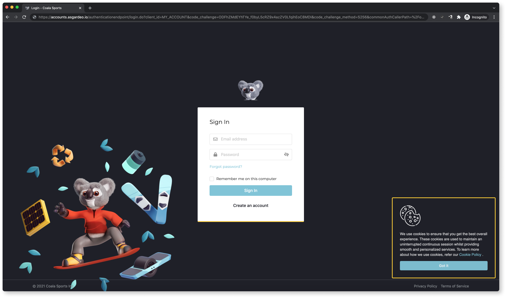

<p align="center">
    <h3 align="center">:rotating_light: :construction:&ensp;&ensp;Work In Progress&ensp;&ensp;:construction: :rotating_light:</h3>
    
    <h1 align="center">Asgardeo UI Branding & Theming</h1>
    <p align="center" style="font-size: 1.2rem;">Instructions and artifacts which'll help achieve organization level UI branding in Asgardeo.</p>
</p>

## Prerequisite

### An account on Asgardeo

You need to join an organization in Asgardeo. Follow the [documentation](https://wso2.com/asgardeo/docs/get-started/create-asgardeo-account/#sign-up) and create an account along with an organization in Asgardeo.

If you already have an organization, you can use that or create a new following instructions in [here](https://wso2.com/asgardeo/docs/guides/your-asgardeo/manage-organizations/#create-an-organization).

## Setting Up

### Setting up Branding via the API

You can use the Branding Preferences API directly and update the branding for your organization.

#### Endpoint

```shell
https://api.asgardeo.io/t/<ORGANIZATION>/api/server/v1/branding-preference
```

#### Sample Payload

Following is a sample payload for an organization called Coala Sports (domain name - `coalasports`).

```json
{
    "type": "ORG",
    "name": "coalasports",
    "locale": "en-US",
    "preference": {
        "organizationDetails": {
            "siteTitle": "Login - Coala Sports",
            "copyrightText": "© 2021 Coala Sports Inc.",
            "supportEmail": "support@coalasports.com"
        },
        "images": {
            "logo": {
                "imgURL": "https://cdn.statically.io/gh/brionmario/asgardeo-branding/main/images/logo.png",
                "altText": "Coala Sports Logo"
            },
            "favicon": {
                "imgURL": "https://cdn.statically.io/gh/brionmario/asgardeo-branding/main/images/favicon.ico"
            }
        },
        "urls": {
            "privacyPolicyURL": "https://coalasports.com/privacy-policy",
            "termsOfUseURL": "https://coalasports.com/terms-of-service/",
            "cookiePolicyURL": "https://coalasports.com/privacy-policy/#cookie-policy"
        },
        "stylesheets": {
            "accountApp": "https://cdn.statically.io/gh/brionmario/asgardeo-branding/main/stylesheets/login-portal.overrides.css"
        },
        "configs": {
            "isBrandingEnabled": true
        }
    }
}
```

Click [here](docs/API-SCHEMA.md) to read more about the API schema.

#### Sample Stylesheet

The stylesheet used in the payload could be found [here](./stylesheets/login-portal.overrides.css).

You can modify the CSS according to your liking that matches the styling guidelines of your organization and **host** it on a static server or somewhere like [Firebase](https://firebase.google.com/docs/storage) and obtain a **static URL** to be used in the preferences.

## Testing the Changes

Try to login to your organization's My Account or any of your business applications. In the login screen, you would be able to see the changes.

### Sample Preview

I've used the sample payload and updated the preference of my organization (Coala Sports). You can see a [**live preview here**](https://myaccount.asgardeo.io/t/coalasports target="_blank).

Following is a screenshot of the Coala Sports organization's login page.



## License

Licenses this source under the Apache License, Version 2.0 ([LICENSE](./LICENSE)), You may not use this file except in compliance with the License.
